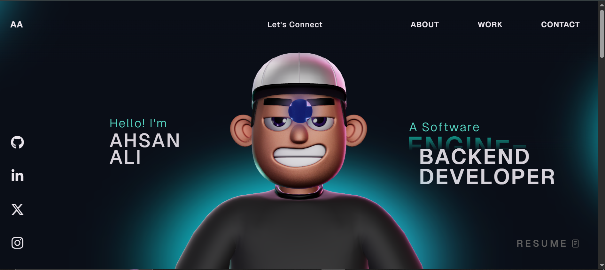

# ali221849.github.io

## Ahsan Ali - Portfolio Website

This repository contains my personal portfolio website.

## About Me

- Name: Ahsan Ali
- Role: Software Engineer, AI Builder, Backend Developer
- Education: BS Software Engineering, Air University (2022-2026)

## Contact

- Email: ahsanaliziddi@gmail.com
- GitHub: https://github.com/Ahsan22ali
- LinkedIn: https://www.linkedin.com/in/ahsan-ali-842709253/

## Tech Stack

React, TypeScript, GSAP, Three.js, WebGL, HTML, CSS, JavaScript

## Local Development

1. Install dependencies:

```bash
pnpm install
```

2. Run development server:

```bash
pnpm dev
```

3. Build for production:

```bash
pnpm build
```

## Preview



## License

This project is open source and available under the [MIT License](LICENSE).
